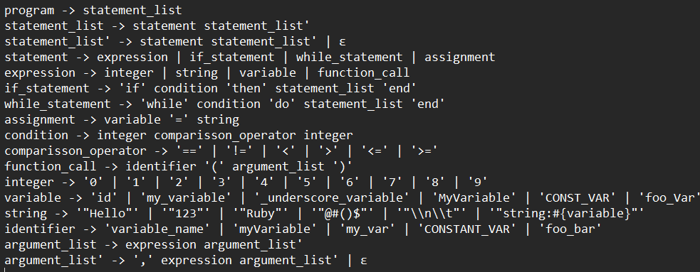

# Description
The language I chose to generate its grammar was *Ruby programming language*.
### The Language: Ruby
Ruby is a high-level, interpreted programming language designed for simplicity and productivity. Its elegant syntax is natural to read and easy to write. It supports multiple programming paradigms, including procedural, object-oriented, and functional programming.

### The Modeling Technique: Context-Free Grammar (CFG)
A CFG is a collection of recursive rewriting rules used to generate patterns of strings. A CFG consists of a number of productions, each of which states that a certain symbol can be replaced by a sequence of other symbols. CFG is powerful enough to describe the syntax of most programming languages, and Ruby is no exception. (GeeksforGeeks, 2023a)

### Elimination of Ambiguity
Ambiguity in a grammar means there's more than one way to parse a string according to the grammar. This was resolved by refining the production rules such as the `statement_list` to ensure a unique parse tree for every valid string of the language.

### Elimination of Left Recursion
Left recursion in a CFG occurs when a rule can call itself recursively as its first element, potentially leading to infinite recursion in certain parser implementations. This was removed by refactoring the grammar into right recursion, which is suitable for recursive descent parsers and many other parsing techniques.

# Model of the Solution
### The CFG

The provided CFG for Ruby includes the fundamental elements such as expressions, conditionals, loops, and assignment. The CFG is used to parse simple Ruby-like syntax and can be extended for a more complete representation of the language.

### Elimination of Ambiguity

We will remove any ambiguities associated with how statement_list and argument_list are derived by ensuring that each valid code snippet corresponds to exactly one derivation tree.
#### Explanation of Changes
Intermediate States: introduced statement_tail, as well as argument_tail. They are non-terminals that prevent ambiguity in sequences of statements and arguments.

### Elimination of Left Recursion


In order to eliminate ambiguity we added non-terminal statements 'statement_list_tail' and 'argument_list_tail', so there is no left recursion and the CFG remains the same.
Using the substitution method we saw in class we would get: 
- For *statement_list* with left recursion:
statement_list -> statement statement_list'
statement_list' -> statement statement_list' | ε
- For *argument_list* with left recursion:
argument_list -> expression argument_list'
argument_list' -> ',' expression argument_list' | ε


# Implementation
For the implementation of a tester for my grammar I used Python and the Natural Language Toolkit (NLTK) library, which is a powerful tool for working with human language data. A CFG is defined in the NLTK format, and the `nltk.ChartParser` is used to parse sentences according to this grammar.
### Python Code
The Python code provided defines the CFG and utilizes NLTK's parser. The code tokenizes an input string and attempts to parse it according to the CFG, printing the parse tree if successful.
The grammar tester, implemented in the file grammar_test.py, which uses a CFG as an input an parses through it to generate its parse tree.
To use the Python file, we have to make sure that NLTK is installed and the CFG is correctly defined in the script. Run the script with a test sentence to see if it gets correctly parsed according to the CFG.
The program outputs a parse tree that represents the structure of the input according to the CFG. If the input does not conform to the CFG, the parser will not output a tree.

### Example Inputs and Outputs
- Input: `if 3 < 5 then my_variable = "Ruby" end`
- Output: A parse tree representing the structure of the if-statement.

# Tests
### Test Cases
**Accepted Inputs:**
1. `if 3 < 5 then my_variable = "Ruby" end`
2. `while 3 <= 9 do id = "Hello" end`
3. `id = "Hello"`
4. `my_variable = "string:#{variable}"`

**Rejected Inputs:**
1. `if 3 5 then my_variable = "Ruby" end` (missing comparison operator)
2. `while 3 9 do id = "Hello" end` (missing comparison operator)
3. `id "Hello"` (missing `=`)
4. `variable_name myVariable , foo_bar` (incorrect function call syntax)
5. `if 5 6 then MyVariable = "string:#{variable}" end` (missing comparison operator)

### Documentation of Pushdown Automata / LL1 Parsing
For each test string, the `nltk` library generates a parse tree, demonstrating how the input is parsed according to the grammar. This visual representation helps verify the correctness of the grammar.

### Running the Tests
To run the tests, simply execute the script. The script will parse each test sentence and print whether it is accepted or rejected. If the sentence is accepted, the parse tree will be displayed using `pretty_print()`.

```
Expected Accepted:
Accepted:  if 3 < 5 then my_variable = "Ruby" end
                  program                                   
                    |                                       
            statement_list                                  
                    |                                       
             if_statement                                   
   ________________|________________                         
  |          |        condition        |                    
  |          |        ______|_______    |                    
  |          |       |              |   |                    
  if       integer comparisson_operator integer statement_list
  |          |          |        |      |      |              
  |          3          |        <      5      |              
 then statement assignment                     
     |      |       ______|________                  
    my_variable =      string                       
                |         |                             
                =       "Ruby"                         
     |________________|                                   
                   end                                     

Expected Rejected:
Rejected:  if 3 5 then my_variable = "Ruby" end

...

Expected Rejected:
Rejected:  if 5 6 then MyVariable = "string:#{variable}" end
```

# Analysis
The CFG for this Ruby-like syntax is a Type-2 grammar in the Chomsky Hierarchy. Type-2 grammars, or context-free grammars, have rules with a single non-terminal on the left-hand side and a string of terminals and/or non-terminals on the right. This allows for a hierarchical structure necessary to describe the nested nature of programming language syntax. It is not a Type-1 or context-sensitive grammar because such grammars have rules where the production can depend on the context of the non-terminal, which is unnecessary for the structural patterns in Ruby. Similarly, it is not a Type-3 or regular grammar, which is less expressive and cannot handle the nesting and recursion present in Ruby syntax. (Chomsky Classification Of Grammars, s. f.)

The time complexity if the CFG parsing model using NLTK's library in python is principally tied to the length of the input string, denoted as *n*. Assuming *i* is the position in the input string, the parser examines substrings from position *i* to *n*.

For a comprenhensive CFG, the worst case time complexity is O(n^3), where each of the *n* positions iterates over O(n^2) possible substrings. However, thanks to NLTK's optimizations and a lack of ambiguity in the grammar used in this evidence, the time complexity is typically O(n^2)

# References
- NLP1. (s. f.). https://tildesites.bowdoin.edu/~allen/nlp/nlp1.html#:~:text=A%20context-free%20grammar%20(CFG,reading%20from%20left%20to%20right. \
- GeeksforGeeks. (2023a, julio 11). What is Context-Free Grammar? GeeksforGeeks. https://www.geeksforgeeks.org/what-is-context-free-grammar/
- NLTK :: Natural Language Toolkit. (s. f.). https://www.nltk.org/
- Chomsky Classification of Grammars. (s. f.). https://www.tutorialspoint.com/automata_theory/chomsky_classification_of_grammars.htm
